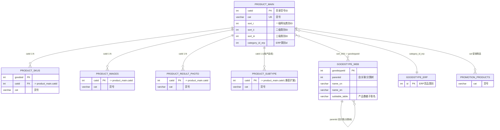
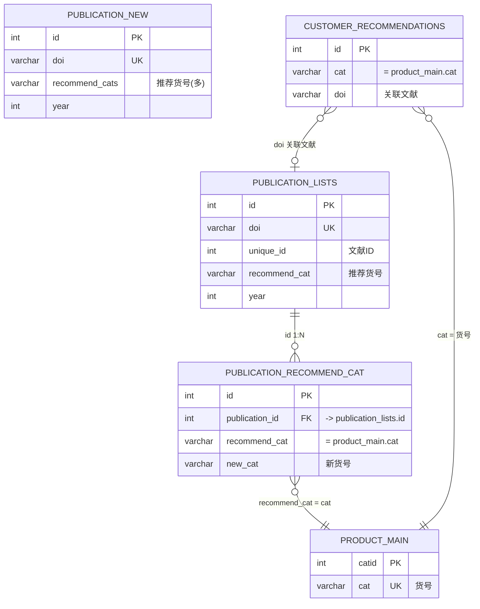
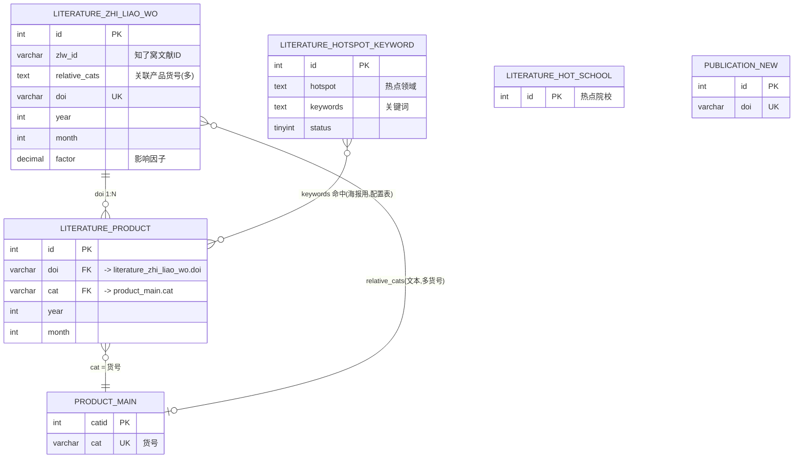
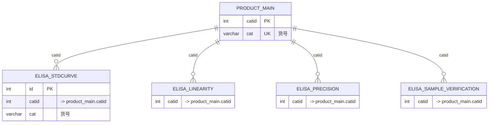
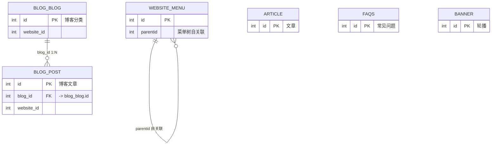
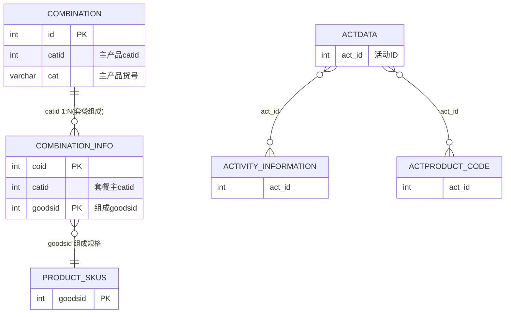
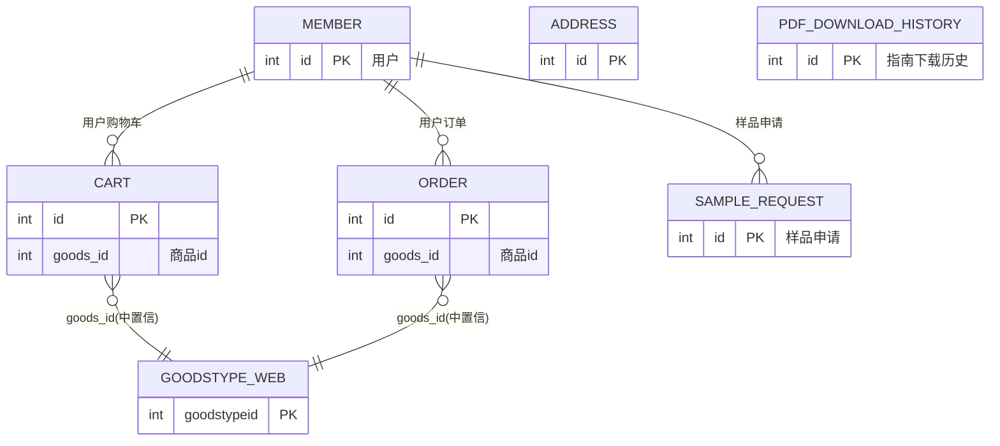

# 数据库关联图 / Relationship Map

> 数据表结构总览与关联图。覆盖 **elabscience（伊莱瑞特）** 与 **procell（普诺赛）** 两个库。
> 配套文件：`catalog-elabscience.md` / `catalog-procell.md`（逐表目录）、`_schema_dump.json`（完整列定义，机器可读）。
> 本文件为**只读分析产物**，所有关联均为对表结构与命名约定的推断，**未做任何 DDL/DML 改动**。

---

## 0. 数据库 / 站点 / 前缀 映射

| 数据库 | host:port | 用户 | 站点前缀 | 站点 |
|---|---|---|---|---|
| `elabscience` | 10.30.30.130:3307 | elabscience | `elabcn_` | 伊莱瑞特中文站 |
| `elabscience` | 10.30.30.130:3307 | elabscience | `elabcom_` | 伊莱瑞特英文站 |
| `procell` | 10.30.30.130:3307 | procell | `procellcn_` | 普诺赛中文站 |
| `procell` | 10.30.30.130:3307 | procell | `pricella_` | 普诺赛英文站 |

**核心结论：4 个站点的表结构是相互镜像的**（`elabcn_*≈elabcom_*`、`procellcn_*≈pricella_*`），同一套领域模型只是中英文字段与少量站点专属表不同。下方 ER 图以「去前缀的领域实体」表达，凡是标注 *（四站通用）* 的，均指 4 个前缀各自有一套同名结构。

---

## 1. 关联推断原则（重要）

- **两个库均声明 0 条外键约束（FK）**。关系完全靠**命名约定 + 共享键列**推断（典型 ThinkPHP/webman 风格）。
- 产品主表的**主键是 `catid`（目录货号 ID），不是 `id`**；产品之间通过**货号 `cat` / `catid`** 关联，而不是自增 id。
- 文献与产品的关联多为**桥接表 / 文本字段**（如 `recommend_cat`、`relative_cats`、`doi`）。
- 置信度标注：**高**=列名+类型+注释三重吻合；**中**=命名吻合但存在多候选；**低**=疑似关联，需业务确认。

---

## 2. 产品域（四站通用）

货号（`cat`/`catid`）是产品体系的枢纽键。

- `PRODUCT_SUBTYPE` 指代各产品线的垂直子表，按前缀不同分别为：
  - 伊莱瑞特：`product_antibody_and_reagents`、`product_proteins`(en:`product_proteins_and_peptides`)、`product_immunoassays`、`product_cell_health_detection`、`product_metabolism`、`product_cell_isolation_and_identification`；英文站另有 `product_pricella`、`product_pricella_composition`。
  - 普诺赛：产品体系以 `product_main` + `product_skus` + `cell_culture_medium` / `reagents` / `serum` / `selfprovidedreagents` / `composition` / `product_formula` 等子表表达（见第 8 节）。
- `goodstype_web.subtable_table` 指向该产品线对应的子表名（程序据此路由到垂直子表）。
- 关联置信度：**高**。

---

## 3. 文献域 — 伊莱瑞特（elabscience / `elabcn_` `elabcom_`）

- `publication_lists` 为**历史主文献表**（量大）；`publication_new` 为**新版活跃文献表**（字段更规整）。
- `publication_recommend_cat` 是**文献↔推荐产品**桥接表：`publication_id` 指向 `publication_lists.id`，`recommend_cat` 存的是产品 `cat`（货号），不是 id。
- `customer_recommendations`（客户评荐）通过 `cat`（货号）挂产品、通过 `doi` 挂文献。
- `publication_old_2026*` 为归档快照表，结构与 `publication_lists` 一致。
- 置信度：**高**。

---

## 4. 文献域 — 普诺赛（procell / `procellcn_`）★ 含知了窝

这是当前 **zhiliaowo-proxy（知了窝文献海报）** 的核心数据源。

- **`procellcn_literature_zhi_liao_wo`** = 来自知了窝的文献主表（`doi` 唯一，`year`/`month` 用于海报统计）。`relative_cats` 是以文本存放的关联产品货号列表。
- **`procellcn_literature_product`** = 文献↔产品桥接表：`doi` 关联文献、`cat` 关联产品货号（这是海报「产品引用」板块的数据源）。
- **`procellcn_literature_hotspot_keyword`** = 热点领域↔关键词映射配置（海报「研究热点」板块用，属配置表，非外键）。
- `procellcn_publication_new` / `publication_lists` 亦存在（与伊莱瑞特同理，为站点文献展示表）。
- ⚠️ 注意：`procellcn_literature_*` 系列**仅普诺赛中文站有**，英文站 `pricella_` 无对应表。
- 置信度：**高**。

---

## 5. ELISA 数据域（四站通用，伊莱瑞特数据量最大）

- 4 张 ELISA 验证表（标曲 / 线性 / 精密度 / 样本验证）均通过 `catid`/`cat` 挂产品主表，是产品详情页「验证数据」的数据源。
- 置信度：**高**。

---

## 6. 内容 / CMS 域（四站通用）

- `blog_post.blog_id -> blog_blog.id`、`website_menu.parentid` 自关联（菜单树）为**高**置信。
- `blog_post.website_id` / `blog_blog.website_id` 疑似指向站点/频道（`website_menu` 或独立 site 概念），**中**置信，需业务确认具体目标。
- `article`/`faqs`/`banner`/`event`/`brochure`/`videos`/`home` 多为独立内容表，彼此弱关联。

---

## 7. 营销 / 套餐 / 活动域（procell 为主）

- `combination`(套餐主表) ↔ `combination_info`(套餐从表，按 `goodsid` 指向 `product_skus`)：普诺赛套餐/组合促销模型。置信度：**高**。
- `actdata`(活动效果) ↔ `activity_information`/`actproduct_code`(活动参与识别码)：通过 `act_id` 关联。置信度：**中**。

---

## 8. 用户 / 订单 / 电商域（pricella_ 英文站为主）

- `pricella_member`(用户) 是电商域根；`cart`/`order`/`sample_request`/`pdf_download_history`/`message`/`mail_list`/`webinars_*` 围绕用户。
- `order.goods_id` / `cart.goods_id` 疑似指向 `goodstype_web`(商品分类) 或产品，*中* 置信（英文站电商表结构需结合业务再确认）。
- 中文站 `procellcn_` 仅有 `customer_evaluation`、`salesman`、`information_history` 等轻量表，无独立订单/用户表（订单在 ERP/Odoo 侧）。
- 伊莱瑞特英文站 `elabcom_odoo_*`(odoo_order/odoo_user) 为对接 Odoo ERP 的订单/用户同步表。

---

## 9. 视图（VIEW）说明

两库均含大量 `VIEW`（以 `_view` / `_base_view` / `publication_repeat` 结尾），多为报表/导出用的只读视图，**不要对视图做写操作**。典型：
- `publication_lists_base_view`、`journal_article`、`wbm_cats_detail_url`（elabscience）
- `cell_culture_medium_view`、`cell_resource_library_view`、`reagents_view`、`pdf_data2025*`、`export_flow_view_250427`（procell）
- `publication_repeat`（跨库/汇总视图）

---

## 10. 关系明细速查表（带置信度）

| 源表.列 | 目标表.列 | 类型 | 置信 | 说明 |
|---|---|---|---|---|
| `product_skus.catid` | `product_main.catid` | 1:N | 高 | 产品规格 |
| `product_images.catid` | `product_main.catid` | 1:N | 高 | 产品图片 |
| `product_result_photo.catid` | `product_main.catid` | 1:N | 高 | 结果图 |
| `product_*子表.catid` | `product_main.catid` | 1:1 | 高 | 垂直扩展子表 |
| `product_main.sort_i/ii/iii` | `goodstype_web.goodstypeid` | N:1 | 高 | 网站分类 |
| `product_main.category_id_erp` | `goodstype_erp.id` | N:1 | 高 | ERP 分类 |
| `goodstype_web.parentid` | `goodstype_web.id` | 自关联 | 高 | 分类树 |
| `publication_recommend_cat.publication_id` | `publication_lists.id` | 1:N | 高 | 文献推荐桥 |
| `publication_recommend_cat.recommend_cat` | `product_main.cat` | N:1 | 高 | 推荐货号 |
| `customer_recommendations.cat` | `product_main.cat` | N:1 | 高 | 评荐挂产品 |
| `customer_recommendations.doi` | `publication_lists.doi` | N:1 | 中 | 评荐挂文献 |
| `literature_product.doi` | `literature_zhi_liao_wo.doi` | 1:N | 高 | 知了窝文献桥 |
| `literature_product.cat` | `product_main.cat` | N:1 | 高 | 文献挂产品 |
| `literature_zhi_liao_wo.relative_cats` | `product_main.cat` | N:M(文本) | 中 | 多货号文本字段 |
| `elisa_*.catid` | `product_main.catid` | 1:N | 高 | ELISA 验证数据 |
| `blog_post.blog_id` | `blog_blog.id` | N:1 | 高 | 博客文章分类 |
| `website_menu.parentid` | `website_menu.id` | 自关联 | 高 | 菜单树 |
| `combination_info.catid` | `combination.catid` | 1:N | 高 | 套餐组成 |
| `combination_info.goodsid` | `product_skus.goodsid` | N:1 | 高 | 套餐规格 |
| `actdata.act_id` | `activity_information.act_id` | 1:N | 中 | 活动 |
| `pricella_order.goods_id` / `cart.goods_id` | `goodstype_web`(?) | N:1 | 中 | 电商商品(待确认) |

---

## 11. 后续扩展建议

- 新增库/表时，把信息 schema 重新 dump 后，重跑 `_gencatalog.py` 即可刷新目录；本 `relationships.md` 需人工增量补充新领域（建议按第 2~8 节同构追加）。
- 若未来需要**可执行的 FK 验证**，可针对「高置信」关联写 `SELECT ... LEFT JOIN ... WHERE 右表 IS NULL` 的孤儿数据核查脚本（只读）。
- 销售/订单类关联（第 8 节 `中` 置信）建议结合业务方确认 `goods_id` 真实指向，再升级为「高」置信。
